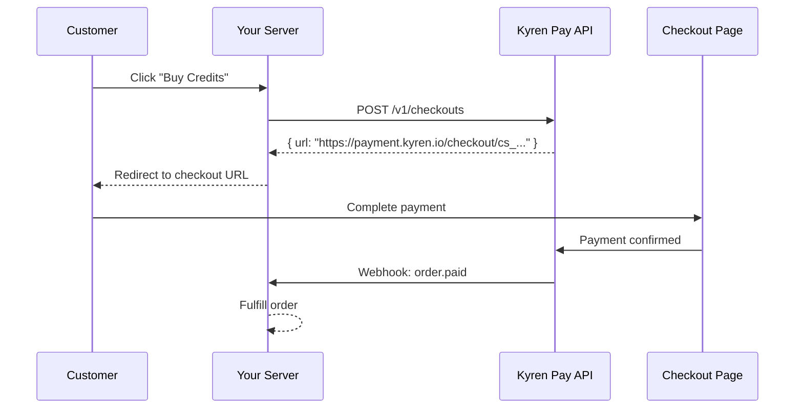

This guide walks you through a complete payment integration using a Node.js backend as an example. The same concepts apply to any programming language.

## Overview



## 1. Set Up Your Server

Install the required dependencies:

```bash
npm init -y
npm install express axios
```

Create your server file:

```javascript
// server.js
const express = require('express');
const crypto = require('crypto');
const axios = require('axios');

const app = express();

const KYREN_API_KEY = process.env.KYREN_API_KEY;
const KYREN_WEBHOOK_SECRET = process.env.KYREN_WEBHOOK_SECRET;
const KYREN_BASE_URL = 'https://api.kyren.top';

// Parse JSON for regular routes
app.use(express.json());
```

## 2. Create a Product (One-Time Setup)

You only need to create a product once. You can do this via the API or the Dashboard.

```javascript
async function createProduct() {
  const response = await axios.post(`${KYREN_BASE_URL}/v1/products`, {
    name: '1000 AI Credits',
    description: 'Top up 1000 credits for AI API usage',
    price: 9.99,
    currency: 'USD',
    metadata: { credits: '1000' }
  }, {
    headers: { 'x-api-key': KYREN_API_KEY }
  });

  console.log('Product created:', response.data.data.id);
  return response.data.data;
}
```

## 3. Create Checkout Endpoint

Add an endpoint that creates a checkout session when the customer clicks "Buy":

```javascript
app.post('/api/buy-credits', async (req, res) => {
  try {
    const response = await axios.post(`${KYREN_BASE_URL}/v1/checkouts`, {
      productId: 'prod_abc123',  // Your product ID from step 2
      successUrl: 'https://yoursite.com/payment/success',
      cancelUrl: 'https://yoursite.com/payment/cancel',
      customerEmail: req.body.email,
      metadata: {
        userId: req.body.userId
      }
    }, {
      headers: { 'x-api-key': KYREN_API_KEY }
    });

    // Return the checkout URL to the frontend
    res.json({ checkoutUrl: response.data.data.url });
  } catch (error) {
    console.error('Checkout creation failed:', error.response?.data);
    res.status(500).json({ error: 'Failed to create checkout' });
  }
});
```

## 4. Handle the Frontend Redirect

On your frontend, redirect the customer to the checkout page:

```html
<button id="buy-btn">Buy 1000 Credits - $9.99</button>

<script>
document.getElementById('buy-btn').addEventListener('click', async () => {
  const response = await fetch('/api/buy-credits', {
    method: 'POST',
    headers: { 'Content-Type': 'application/json' },
    body: JSON.stringify({
      email: 'customer@example.com',
      userId: 'user_123'
    })
  });

  const { checkoutUrl } = await response.json();
  window.location.href = checkoutUrl;
});
</script>
```

## 5. Handle Webhooks

Add a webhook endpoint to receive payment notifications:

```javascript
function verifySignature(payload, signature, timestamp) {
  const data = `${timestamp}.${payload}`;
  const expected = 'sha256=' + crypto
    .createHmac('sha256', KYREN_WEBHOOK_SECRET)
    .update(data)
    .digest('hex');

  // Verify timestamp is within 5 minutes
  const currentTime = Math.floor(Date.now() / 1000);
  if (Math.abs(currentTime - parseInt(timestamp)) > 300) {
    return false;
  }

  return crypto.timingSafeEqual(
    Buffer.from(expected),
    Buffer.from(signature)
  );
}

app.post('/webhooks/kyren',
  express.raw({ type: 'application/json' }),
  (req, res) => {
    const signature = req.headers['x-kyren-signature'];
    const timestamp = req.headers['x-kyren-timestamp'];
    const payload = req.body.toString();

    if (!verifySignature(payload, signature, timestamp)) {
      return res.status(400).send('Invalid signature');
    }

    const event = JSON.parse(payload);

    switch (event.type) {
      case 'order.paid':
        const { order_id, product_id, customer_email, amount, currency } = event.data;
        console.log(`Payment received: ${amount} ${currency} from ${customer_email}`);
        // TODO: Fulfill the order — add credits to the user's account
        break;
      default:
        console.log(`Unhandled event type: ${event.type}`);
    }

    res.status(200).send('OK');
  }
);
```

## 6. Start the Server

```javascript
app.listen(3000, () => {
  console.log('Server running on http://localhost:3000');
});
```

Run your server:

```bash
KYREN_API_KEY=kyren_test_xxx KYREN_WEBHOOK_SECRET=whsec_xxx node server.js
```

## 7. Test the Flow

1. Open your app and click "Buy 1000 Credits"
2. You'll be redirected to the Kyren Pay checkout page
3. Enter test card number `4242 4242 4242 4242`
4. Complete the payment
5. Check your server logs — you should see the webhook arrive

<Check>
  Congratulations! You've successfully integrated Kyren Pay. When you're ready, switch to your live API key and start accepting real payments.
</Check>

## Next Steps

<CardGroup cols={2}>
  <Card title="Webhook Events" icon="bell" href="/webhooks/events">
    See all available webhook event types
  </Card>
  <Card title="Code Examples" icon="code" href="/guides/code-examples">
    See integration examples in other languages
  </Card>
</CardGroup>
