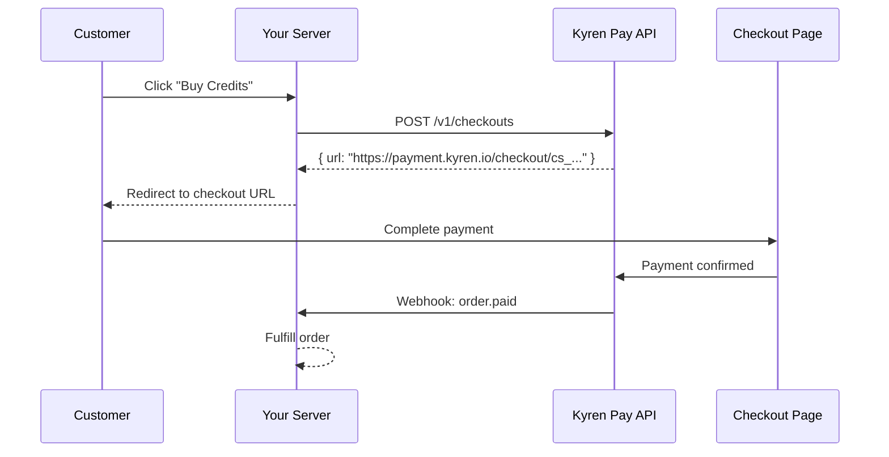

This guide walks you through a complete payment integration using a Node.js backend as an example. The same concepts apply to any programming language.

## Choose your setup path

- Use the dashboard guide if you want to create products and review orders manually first.
- Use the API guide if your application should create checkout sessions from your server.

Related pages:

- [Products dashboard](/dashboard/products)
- [Orders dashboard](/dashboard/orders)
- [Quickstart](/quickstart)
- [Webhook overview](/webhooks/overview)

## Overview


```mermaid
sequenceDiagram
    participant Customer
    participant YourServer as Your Server
    participant KyrenPay as Kyren Pay API
    participant Checkout as Checkout Page

    Customer->>YourServer: Click "Buy Credits"
    YourServer->>KyrenPay: POST /v1/checkouts
    KyrenPay-->>YourServer: { url: "https://payment.kyren.io/checkout/cs_..." }
    YourServer-->>Customer: Redirect to checkout URL
    Customer->>Checkout: Complete payment
    Checkout->>KyrenPay: Payment confirmed
    KyrenPay->>YourServer: Webhook: order.paid
    YourServer-->>YourServer: Fulfill order
```

## 1. Set Up Your Server

Install the required dependencies:

```bash
npm init -y
npm install express axios
```

Create your server file:

```javascript
// server.js
const express = require('express');
const crypto = require('crypto');
const axios = require('axios');

const app = express();

const KYREN_API_KEY = process.env.KYREN_API_KEY;
const KYREN_WEBHOOK_SECRET = process.env.KYREN_WEBHOOK_SECRET;
const KYREN_BASE_URL = 'https://api.kyren.top';

// Parse JSON for regular routes
app.use(express.json());
```

## 2. Create a Product (One-Time Setup)

You only need to create a product once. You can do this via the API or the Dashboard.

```javascript
async function createProduct() {
  const response = await axios.post(`${KYREN_BASE_URL}/v1/products`, {
    name: '1000 AI Credits',
    description: 'Top up 1000 credits for AI API usage',
    price: '9.99',
    currency: 'USD',
    metadata: { credits: '1000' }
  }, {
    headers: { 'x-api-key': KYREN_API_KEY }
  });

  console.log('Product created:', response.data.data.id);
  return response.data.data;
}
```

## 3. Create Checkout Endpoint

Add an endpoint that creates a checkout session when the customer clicks "Buy":

```javascript
app.post('/api/buy-credits', async (req, res) => {
  try {
    const response = await axios.post(`${KYREN_BASE_URL}/v1/checkouts`, {
      productId: 'prod_abc123',  // Your product ID from step 2
      successUrl: 'https://yoursite.com/payment/success',
      cancelUrl: 'https://yoursite.com/payment/cancel',
      customerEmail: req.body.email,
      metadata: {
        userId: req.body.userId
      }
    }, {
      headers: { 'x-api-key': KYREN_API_KEY }
    });

    // Return the checkout URL to the frontend
    res.json({ checkoutUrl: response.data.data.url });
  } catch (error) {
    console.error('Checkout creation failed:', error.response?.data);
    res.status(500).json({ error: 'Failed to create checkout' });
  }
});
```

## 4. Handle the Frontend Redirect

On your frontend, redirect the customer to the checkout page:

```html
<button id="buy-btn">Buy 1000 Credits - $9.99</button>

<script>
document.getElementById('buy-btn').addEventListener('click', async () => {
  const response = await fetch('/api/buy-credits', {
    method: 'POST',
    headers: { 'Content-Type': 'application/json' },
    body: JSON.stringify({
      email: 'customer@example.com',
      userId: 'user_123'
    })
  });

  const { checkoutUrl } = await response.json();
  window.location.href = checkoutUrl;
});
</script>
```

## 5. Handle Webhooks

Add a webhook endpoint to receive payment notifications:

```javascript
function verifySignature(payload, signature, timestamp) {
  const data = `${timestamp}.${payload}`;
  const expected = 'sha256=' + crypto
    .createHmac('sha256', KYREN_WEBHOOK_SECRET)
    .update(data)
    .digest('hex');

  // Verify millisecond timestamp is within 5 minutes
  const currentTime = Date.now();
  if (Math.abs(currentTime - Number(timestamp)) > 5 * 60 * 1000) {
    return false;
  }

  return crypto.timingSafeEqual(
    Buffer.from(expected),
    Buffer.from(signature)
  );
}

app.post('/webhooks/kyren',
  express.raw({ type: 'application/json' }),
  (req, res) => {
    const signature = req.headers['x-kyren-signature'];
    const timestamp = req.headers['x-kyren-timestamp'];
    const payload = req.body.toString();

    if (!verifySignature(payload, signature, timestamp)) {
      return res.status(400).send('Invalid signature');
    }

    const event = JSON.parse(payload);

    switch (event.type) {
      case 'order.paid':
        const { order_id, product_id, customer_email, amount, currency } = event.data;
        console.log(`Payment received: ${amount} ${currency} from ${customer_email}`);
        // TODO: Fulfill the order — add credits to the user's account
        break;
      default:
        console.log(`Unhandled event type: ${event.type}`);
    }

    res.status(200).send('OK');
  }
);
```

## 6. Start the Server

```javascript
app.listen(3000, () => {
  console.log('Server running on http://localhost:3000');
});
```

Run your server:

```bash
KYREN_API_KEY=kyren_live_xxx KYREN_WEBHOOK_SECRET=whsec_xxx node server.js
```

## 7. Test the Flow

1. If Kyren has issued staging credentials or enabled a test-capable gateway for your merchant account, run the flow with those credentials and the payment scenarios Kyren provides.
2. If you only have live credentials, verify the flow with a low-risk real payment in production.
3. Confirm your customer is redirected to the Kyren Pay checkout page.
4. Confirm your server receives the payment Webhook and that your fulfillment logic handles the event correctly.
5. If you used a real payment for verification, refund or handle it operationally according to Kyren support guidance if needed.

<Check>
  Your integration is ready when checkout creation, redirect handling, Webhook receipt, and fulfillment have all been verified with the credentials and gateway Kyren has enabled for your account.
</Check>

## Next Steps

<CardGroup cols={2}>
  <Card title="Webhook Events" icon="bell" href="/webhooks/events">
    See all available webhook event types
  </Card>
  <Card title="Code Examples" icon="code" href="/guides/code-examples">
    See integration examples in other languages
  </Card>
</CardGroup>
