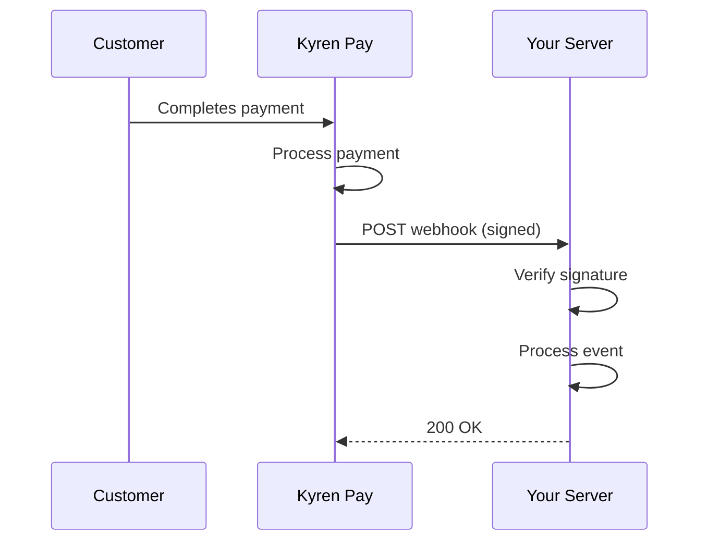

Webhooks allow Kyren Pay to send real-time notifications to your server when events happen in your account — such as a successful payment or a completed payout.

## How Webhooks Work



1. An event occurs (e.g., a customer completes a payment)
2. Kyren Pay sends an HTTP POST request to your configured webhook URL
3. The request includes a signature for verification
4. Your server processes the event and returns a `200` response

## Configuring Webhooks

Set up your webhook endpoint in the [Merchant Dashboard](https://dashboard.kyren.top):

1. Go to **Dashboard > Developer > Webhook Settings**
2. Enter your **Webhook URL** (e.g., `https://yoursite.com/webhooks/kyren`)
3. Copy your **Webhook Secret** — you'll need this to verify signatures

<Warning>
  Your webhook URL must:
  - Use HTTPS (required for production)
  - Be publicly accessible
  - Return a `2xx` response within 30 seconds
</Warning>

## Webhook Payload

Every webhook request includes these headers:

| Header | Description |
| --- | --- |
| `Content-Type` | `application/json` |
| `X-Kyren-Signature` | HMAC-SHA256 signature for verification |
| `X-Kyren-Timestamp` | Unix timestamp when the webhook was sent |

The request body is a JSON object:

```json
{
  "id": "evt_abc123",
  "type": "order.paid",
  "created_at": "2026-01-15T10:35:00Z",
  "data": {
    "order_id": "order_def456",
    "product_id": "prod_abc123",
    "customer_email": "customer@example.com",
    "amount": 9.99,
    "currency": "USD",
    "net_amount": 9.29,
    "paid_at": "2026-01-15T10:35:00Z"
  }
}
```

## Best Practices

<CardGroup cols={2}>
  <Card title="Verify Signatures" icon="shield-check">
    Always verify the `X-Kyren-Signature` header to ensure the webhook is authentic. See [Webhook Signatures](/webhooks/signatures).
  </Card>
  <Card title="Return 200 Quickly" icon="clock">
    Return a `200` response as soon as you receive the webhook. Process the event asynchronously if it takes more than a few seconds.
  </Card>
  <Card title="Handle Duplicates" icon="copy">
    Use the event `id` to deduplicate. Your endpoint may receive the same event more than once due to retries.
  </Card>
  <Card title="Use a Queue" icon="list">
    For production, consider pushing webhook events to a message queue (e.g., RabbitMQ, SQS) for reliable processing.
  </Card>
</CardGroup>

## Next Steps

<CardGroup cols={3}>
  <Card title="Events" icon="bell" href="/webhooks/events">
    See all event types
  </Card>
  <Card title="Signatures" icon="key" href="/webhooks/signatures">
    Verify webhook signatures
  </Card>
  <Card title="Retries" icon="rotate" href="/webhooks/retries">
    Understand retry behavior
  </Card>
</CardGroup>
