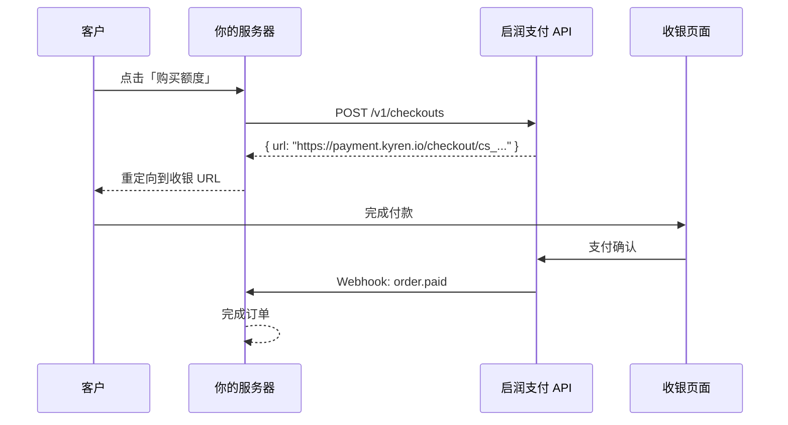

本指南以 Node.js 后端为例，带你完成完整的支付集成。相同的概念适用于任何编程语言。

## 概览



## 1. 搭建服务器

安装所需依赖：

```bash
npm init -y
npm install express axios
```

创建服务器文件：

```javascript
// server.js
const express = require('express');
const crypto = require('crypto');
const axios = require('axios');

const app = express();

const KYREN_API_KEY = process.env.KYREN_API_KEY;
const KYREN_WEBHOOK_SECRET = process.env.KYREN_WEBHOOK_SECRET;
const KYREN_BASE_URL = 'https://api.kyren.top';

app.use(express.json());
```

## 2. 创建产品（一次性操作）

你只需创建一次产品，可以通过 API 或控制台完成。

```javascript
async function createProduct() {
  const response = await axios.post(`${KYREN_BASE_URL}/v1/products`, {
    name: '1000 AI Credits',
    description: '充值 1000 个 AI API 额度',
    price: '9.99',
    currency: 'USD',
    metadata: { credits: '1000' }
  }, {
    headers: { 'x-api-key': KYREN_API_KEY }
  });

  console.log('产品已创建:', response.data.data.id);
  return response.data.data;
}
```

## 3. 创建收银接口

添加一个在客户点击「购买」时创建 Checkout Session 的接口：

```javascript
app.post('/api/buy-credits', async (req, res) => {
  try {
    const response = await axios.post(`${KYREN_BASE_URL}/v1/checkouts`, {
      productId: 'prod_abc123',
      successUrl: 'https://yoursite.com/payment/success',
      cancelUrl: 'https://yoursite.com/payment/cancel',
      customerEmail: req.body.email,
      metadata: { userId: req.body.userId }
    }, {
      headers: { 'x-api-key': KYREN_API_KEY }
    });

    res.json({ checkoutUrl: response.data.data.url });
  } catch (error) {
    console.error('创建收银失败:', error.response?.data);
    res.status(500).json({ error: '创建收银失败' });
  }
});
```

## 4. 处理前端重定向

在前端将客户重定向到收银页面：

```html
<button id="buy-btn">购买 1000 额度 - $9.99</button>

<script>
document.getElementById('buy-btn').addEventListener('click', async () => {
  const response = await fetch('/api/buy-credits', {
    method: 'POST',
    headers: { 'Content-Type': 'application/json' },
    body: JSON.stringify({
      email: 'customer@example.com',
      userId: 'user_123'
    })
  });

  const { checkoutUrl } = await response.json();
  window.location.href = checkoutUrl;
});
</script>
```

## 5. 处理 Webhook

添加 Webhook 端点以接收支付通知：

```javascript
function verifySignature(payload, signature, timestamp) {
  const data = `${timestamp}.${payload}`;
  const expected = 'sha256=' + crypto
    .createHmac('sha256', KYREN_WEBHOOK_SECRET)
    .update(data)
    .digest('hex');

  const currentTime = Math.floor(Date.now() / 1000);
  if (Math.abs(currentTime - parseInt(timestamp)) > 300) {
    return false;
  }

  return crypto.timingSafeEqual(
    Buffer.from(expected),
    Buffer.from(signature)
  );
}

app.post('/webhooks/kyren',
  express.raw({ type: 'application/json' }),
  (req, res) => {
    const signature = req.headers['x-kyren-signature'];
    const timestamp = req.headers['x-kyren-timestamp'];
    const payload = req.body.toString();

    if (!verifySignature(payload, signature, timestamp)) {
      return res.status(400).send('Invalid signature');
    }

    const event = JSON.parse(payload);

    switch (event.type) {
      case 'order.paid':
        const { order_id, product_id, customer_email, amount, currency } = event.data;
        console.log(`收到付款: ${amount} ${currency}，来自 ${customer_email}`);
        // TODO: 完成订单 — 为用户账户充值额度
        break;
      default:
        console.log(`未处理的事件类型: ${event.type}`);
    }

    res.status(200).send('OK');
  }
);
```

## 6. 启动服务器

```javascript
app.listen(3000, () => {
  console.log('服务器运行在 http://localhost:3000');
});
```

运行：

```bash
KYREN_API_KEY=kyren_test_xxx KYREN_WEBHOOK_SECRET=whsec_xxx node server.js
```

## 7. 测试流程

1. 打开你的应用，点击「购买 1000 额度」
2. 你将被重定向到启润支付收银页面
3. 输入测试卡号 `4242 4242 4242 4242`
4. 完成付款
5. 检查服务器日志 — 你应该能看到 Webhook 到达

<Check>
  恭喜！你已经成功集成了启润支付。准备好后，切换到生产 API 密钥即可开始接收真实付款。
</Check>

## 下一步

<CardGroup cols={2}>
  <Card title="Webhook 事件" icon="bell" href="/zh/webhooks/events">
    查看所有可用的 Webhook 事件类型
  </Card>
  <Card title="代码示例" icon="code" href="/zh/guides/code-examples">
    查看其他语言的集成示例
  </Card>
</CardGroup>
