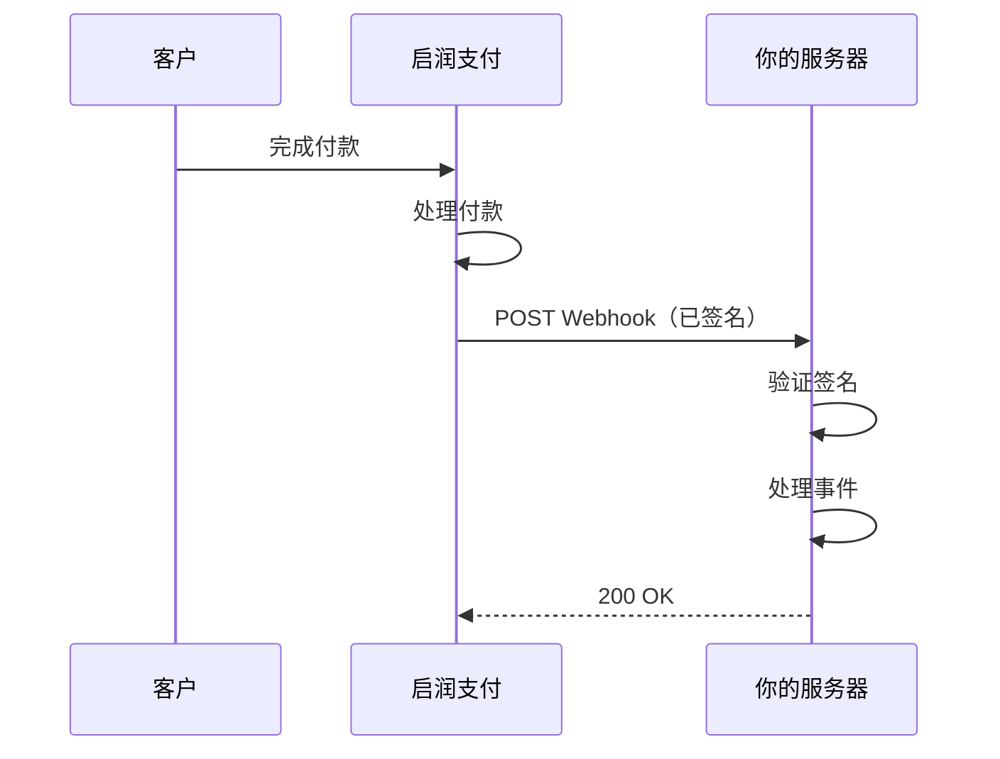

Webhook 允许启润支付在你的账户中发生事件时（如支付成功或结款完成）向你的服务器发送实时通知。

## 工作原理



1. 事件发生（如客户完成付款）
2. 启润支付向你配置的 Webhook URL 发送 HTTP POST 请求
3. 请求中包含用于验证的签名
4. 你的服务器处理事件并返回 `200` 响应

## 配置 Webhook

在[商户控制台](https://dashboard.kyren.top)中设置你的 Webhook 端点：

1. 前往 **控制台 > 开发者 > Webhook 设置**
2. 输入你的 **Webhook URL**（如 `https://yoursite.com/webhooks/kyren`）
3. 复制你的 **Webhook 密钥** — 用于验证签名

<Warning>
  你的 Webhook URL 必须：
  - 使用 HTTPS（生产环境必须）
  - 可公开访问
  - 在 30 秒内返回 `2xx` 响应
</Warning>

## Webhook 载荷

每个 Webhook 请求包含以下请求头：

| 请求头 | 描述 |
| --- | --- |
| `Content-Type` | `application/json` |
| `X-Kyren-Signature` | HMAC-SHA256 签名，用于验证 |
| `X-Kyren-Timestamp` | 发送 Webhook 时的 Unix 时间戳 |

请求体是一个 JSON 对象：

```json
{
  "id": "evt_abc123",
  "type": "order.paid",
  "created_at": "2026-01-15T10:35:00Z",
  "data": {
    "order_id": "order_def456",
    "product_id": "prod_abc123",
    "customer_email": "customer@example.com",
    "amount": 9.99,
    "currency": "USD",
    "net_amount": 9.29,
    "paid_at": "2026-01-15T10:35:00Z"
  }
}
```

## 最佳实践

<CardGroup cols={2}>
  <Card title="验证签名" icon="shield-check">
    始终验证 `X-Kyren-Signature` 请求头以确保 Webhook 的真实性。参见 [Webhook 签名验证](/zh/webhooks/signatures)。
  </Card>
  <Card title="快速返回 200" icon="clock">
    收到 Webhook 后立即返回 `200` 响应。如果处理需要较长时间，请异步处理。
  </Card>
  <Card title="处理重复事件" icon="copy">
    使用事件 `id` 进行去重。由于重试机制，你的端点可能会收到同一事件多次。
  </Card>
  <Card title="使用消息队列" icon="list">
    在生产环境中，考虑将 Webhook 事件推送到消息队列（如 RabbitMQ、SQS）以实现可靠处理。
  </Card>
</CardGroup>

## 下一步

<CardGroup cols={3}>
  <Card title="事件类型" icon="bell" href="/zh/webhooks/events">
    查看所有事件类型
  </Card>
  <Card title="签名验证" icon="key" href="/zh/webhooks/signatures">
    验证 Webhook 签名
  </Card>
  <Card title="重试机制" icon="rotate" href="/zh/webhooks/retries">
    了解重试行为
  </Card>
</CardGroup>
