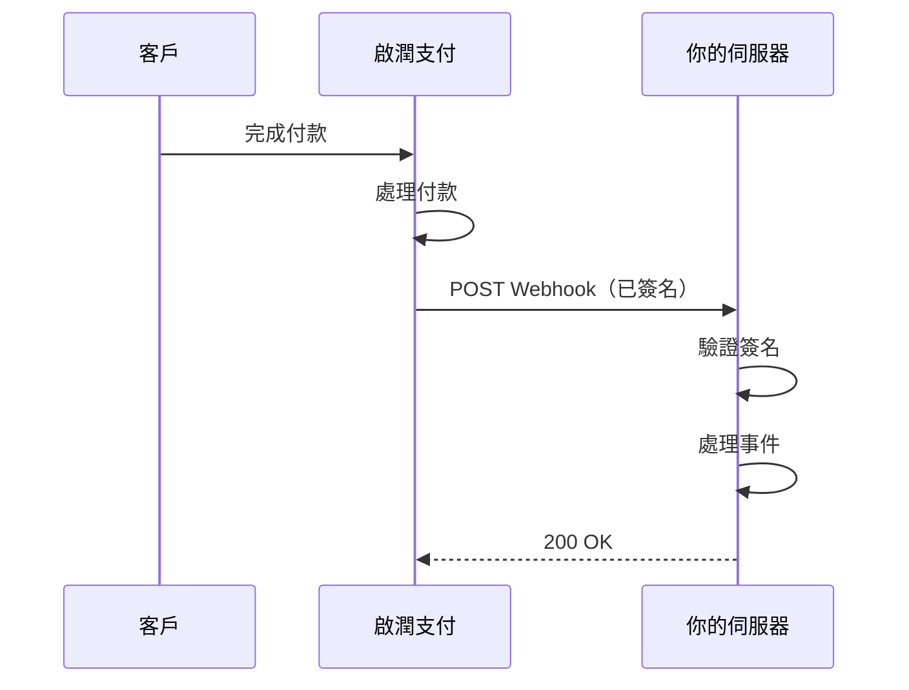

Webhook 允許啟潤支付在你的帳戶中發生事件時（如支付成功或結款完成）向你的伺服器發送即時通知。

## 工作原理


```mermaid
sequenceDiagram
    participant Customer as 客戶
    participant KyrenPay as 啟潤支付
    participant YourServer as 你的伺服器

    Customer->>KyrenPay: 完成付款
    KyrenPay->>KyrenPay: 處理付款
    KyrenPay->>YourServer: POST Webhook（已簽名）
    YourServer->>YourServer: 驗證簽名
    YourServer->>YourServer: 處理事件
    YourServer-->>KyrenPay: 200 OK
```

1. 事件發生（如客戶完成付款）
2. 啟潤支付向你配置的 Webhook URL 發送 HTTP POST 請求
3. 請求中包含用於驗證的簽名
4. 你的伺服器處理事件並返回 `200` 回應

## 配置 Webhook

在[商戶控制台](https://dashboard.kyren.top)中設定你的 Webhook 端點：

1. 前往 **控制台 > 開發者 > Webhook 設定**
2. 輸入你的 **Webhook URL**（如 `https://yoursite.com/webhooks/kyren`）
3. 複製你的 **Webhook 密鑰** — 用於驗證簽名

<Warning>
  你的 Webhook URL 必須：
  - 使用 HTTPS（生產環境必須）
  - 可公開存取
  - 在 30 秒內返回 `2xx` 回應
</Warning>

## Webhook 載荷

每個 Webhook 請求包含以下請求標頭：

| 請求標頭 | 描述 |
| --- | --- |
| `Content-Type` | `application/json` |
| `X-Kyren-Signature` | HMAC-SHA256 簽名，用於驗證 |
| `X-Kyren-Timestamp` | 發送 Webhook 時的 Unix 毫秒時間戳 |

請求本體是一個 JSON 物件：

```json
{
  "id": "evt_abc123",
  "type": "order.paid",
  "created_at": 1736932500000,
  "data": {
    "order_id": "order_def456",
    "product_id": "prod_abc123",
    "customer_email": "customer@example.com",
    "amount": "9.99",
    "currency": "USD",
    "net_amount": "9.29",
    "paid_at": 1736932500000,
    "metadata": {}
  }
}
```

## 最佳實踐

<CardGroup cols={2}>
  <Card title="驗證簽名" icon="shield-check">
    始終驗證 `X-Kyren-Signature` 請求標頭以確保 Webhook 的真實性。參見 [Webhook 簽名驗證](/zh/webhooks/signatures)。
  </Card>
  <Card title="快速返回 200" icon="clock">
    收到 Webhook 後立即返回 `200` 回應。如果處理需要較長時間，請非同步處理。
  </Card>
  <Card title="處理重複事件" icon="copy">
    使用事件 `id` 進行去重。由於重試機制，你的端點可能會收到同一事件多次。
  </Card>
  <Card title="使用訊息佇列" icon="list">
    在生產環境中，考慮將 Webhook 事件推送到訊息佇列（如 RabbitMQ、SQS）以實現可靠處理。
  </Card>
</CardGroup>

## 下一步

<CardGroup cols={3}>
  <Card title="事件類型" icon="bell" href="/zh/webhooks/events">
    查看所有事件類型
  </Card>
  <Card title="簽名驗證" icon="key" href="/zh/webhooks/signatures">
    驗證 Webhook 簽名
  </Card>
  <Card title="重試機制" icon="rotate" href="/zh/webhooks/retries">
    了解重試行為
  </Card>
</CardGroup>
