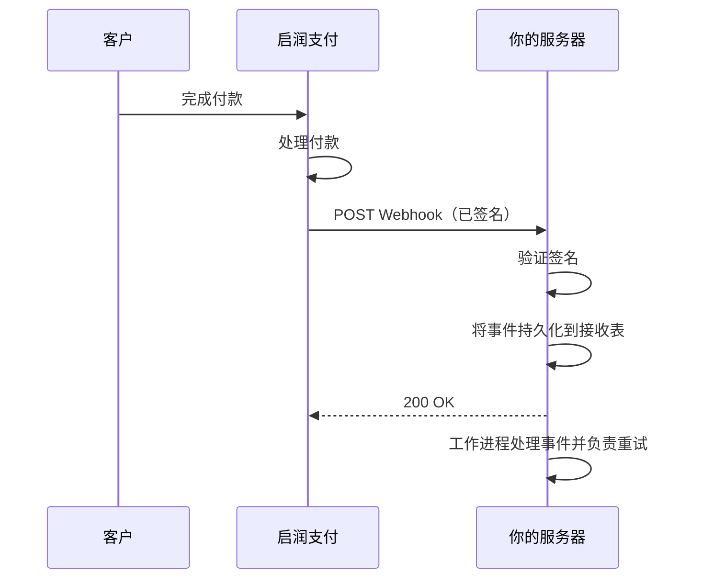

Webhook 允许启润支付在付款或退款成功时向你的服务器发送通知。支持的事件及可选争议通知见[事件类型](/zh/webhooks/events)。

## 工作原理


```mermaid
sequenceDiagram
    participant Customer as 客户
    participant KyrenPay as 启润支付
    participant YourServer as 你的服务器

    Customer->>KyrenPay: 完成付款
    KyrenPay->>KyrenPay: 处理付款
    KyrenPay->>YourServer: POST Webhook（已签名）
    YourServer->>YourServer: 验证签名
    YourServer->>YourServer: 将事件持久化到接收表
    YourServer-->>KyrenPay: 200 OK
    YourServer->>YourServer: 工作进程处理事件并负责重试
```

1. 事件发生（如客户完成付款）
2. 启润支付向你配置的 Webhook URL 发送 HTTP POST 请求
3. 请求中包含用于验证的签名
4. 你的服务器验证签名、持久化事件，并在 10 秒内返回 `200`
5. 工作进程幂等处理已持久化的事件，并负责自己的重试

## 配置 Webhook

在[商户控制台](https://merchant.kyrenpay.com)中设置你的 Webhook 端点：

1. 前往 **控制台 > 开发者 > Webhook 设置**
2. 输入你的 **Webhook URL**（如 `https://yoursite.com/webhooks/kyren`）
3. 复制你的 **Webhook 密钥** — 用于验证签名

<Warning>
  你的 Webhook URL 必须：
  - 使用 HTTPS（生产环境必须）
  - 可公开访问
  - 持久化成功后，在 10 秒内完成 `2xx` 响应
</Warning>

## Webhook 载荷

每个 Webhook 请求包含以下请求头：

| 请求头 | 描述 |
| --- | --- |
| `Content-Type` | `application/json` |
| `X-Kyren-Signature` | HMAC-SHA256 签名，用于验证 |
| `X-Kyren-Timestamp` | 发送 Webhook 时的 Unix 毫秒时间戳 |

请求体是一个 JSON 对象：

```json
{
  "id": "evt_abc123",
  "type": "order.paid",
  "created_at": 1736932500000,
  "data": {
    "order_id": "order_def456",
    "product_id": "prod_abc123",
    "customer_email": "customer@example.com",
    "amount": "9.99",
    "currency": "USD",
    "net_amount": "9.29",
    "paid_at": 1736932500000,
    "metadata": null
  }
}
```

## 最佳实践

<CardGroup cols={2}>
  <Card title="验证签名" icon="shield-check">
    始终验证 `X-Kyren-Signature` 请求头以确保 Webhook 的真实性。参见 [Webhook 签名验证](/zh/webhooks/signatures)。
  </Card>
  <Card title="快速返回 200" icon="clock">
    验证签名并持久化事件后再返回 `200`。持久化失败时返回非 `2xx`，让 Kyren 重试。
  </Card>
  <Card title="处理重复事件" icon="copy">
    使用事件 `id` 进行去重。由于重试机制，你的端点可能会收到同一事件多次。
  </Card>
  <Card title="使用消息队列" icon="list">
    异步处理时，将事件保存到持久化接收表或队列，保存成功后才确认。Kyren 收到 `2xx` 后，工作进程需要负责自己的重试。
  </Card>
</CardGroup>

## 下一步

<CardGroup cols={3}>
  <Card title="事件类型" icon="bell" href="/zh/webhooks/events">
    查看所有事件类型
  </Card>
  <Card title="签名验证" icon="key" href="/zh/webhooks/signatures">
    验证 Webhook 签名
  </Card>
  <Card title="重试机制" icon="rotate" href="/zh/webhooks/retries">
    了解重试行为
  </Card>
</CardGroup>
